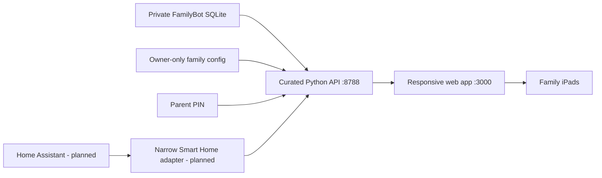

# Development guide and ownership map

This is the canonical cold-start guide for Familieportalen. It explains what the
repository owns, where changes belong and how it remains safely separated from
FamilyBot's reliability core.

## Product role

Familieportalen is the direct iPad-first interface for the household. Its first
screen is a calm family overview. Children can open their own profiles and use
chores/rewards without adult help. Parents can review and manage chores, reward
goals, weekly full-week achievements, surprise redemptions and the family Kanban
board.
OpenClaw remains available for complex questions and operations.
For child-chore creation from Telegram, OpenClaw uses the two-step interview
bridge documented in `docs/TELEGRAM_CHILD_CHORES.md`; the portal remains the
owner of validation and writes.

The sibling `familybot-core` repository owns ingestion, parsing, normalized
facts, briefings, delivery and health. This repository presents a curated view;
it does not decide whether an email or Telegram delivery succeeded.

## Runtime flow

The production supervisor runs API and web processes together. Bonjour advertises
the web service. The API and database remain on the Mac mini.

## Code map

| Area | Owning files | Risk notes |
| --- | --- | --- |
| Main family/child/parent UI | `app/_components/FamilyConsole.tsx` | User-visible; touch, accessibility and state-transition risk |
| Global layout and responsive design | `app/globals.css` | Verify portrait, landscape, 200% zoom and no hover dependency |
| Curated API and authorization | `local_api/familybot_api.py` | Security-critical field/action allowlist, including parent-gated Kanban mutations |
| Dashboard schema and backup | `local_api/dashboard_migration.py` | Data-critical; idempotent migration and pre-migration backup required, including weekly achievement history |
| Config reader | `local_api/family_config.py` | Must match the one core-owned configuration contract |
| Process supervision | `local_service/run_service.py` | Operational; both processes fail/restart as a group |
| Local deployment | `scripts/deploy-local.sh`, `launchd/` | Production mutation; preflight and rollback required |
| API tests | `local_api/test_familybot_api.py` | Authorization, response minimization and state transitions |
| Release acceptance | `tests/acceptance.py`, `tests/rendered-html.test.mjs` | Current release gate |

`worker/index.ts` and `examples/d1/` are framework/scaffold surfaces, not the
LAN production data path. Do not move family state into a cloud worker or D1
because those directories exist.

## Data ownership

Core-owned tables are read through explicit queries. Portal-owned chores,
completions, reward goals and weekly achievement tables are created idempotently
by the portal migration.
The portal may add a separate add-on schema, but it cannot reuse core ledgers or
raw payload columns as a convenient storage area.

Weekly achievement progress is now derived as continuous portal completion
points in `pending` or `awarded` status. Every 30 points makes one full block;
the remainder is shown in a new progress bar immediately. Rejected completions
have zero points and do not contribute. The full-block counter continues until
a parent redeems a surprise. See [the weekly achievement specification](WEEKLY_ACHIEVEMENTS.md)
for the contract and state transitions.

The browser is not entitled to every field returned by SQLite. New response
fields require an explicit privacy decision in `docs/DATA_BOUNDARY.md` and
negative tests for raw/private material.

## UI principles

- Family overview first; detailed child, parent and add-on pages second.
- Large tap targets, immediate feedback and minimal typing.
- No essential hover state.
- Plain family language rather than kanban/admin terminology for children.
- Status text is derived from measured state and timestamp, not optimism.
- Keep DNB Eufemia-inspired visual consistency without coupling business logic
  to a component library.
- The chatbot complements the dashboard; it does not replace direct child use.

## Core versus add-on changes

A school fact or delivery rule belongs in core. Its visual presentation belongs
here. Chores, rewards and weekly achievement surprises are portal-owned
add-ons. Smart Home is another add-on:
Home Assistant owns vendor integrations, a server-side adapter exposes an
allowlist, and the UI renders a separate `/smart-home` page. A Smart Home outage
must leave the family overview and child pages usable.

## Change workflow

1. Start at `AGENTS.md` and classify the change.
2. Confirm the API/data owner and whether SQLite will mutate.
3. Write the standard change record in [`CHANGE_PROTOCOL.md`](CHANGE_PROTOCOL.md)
   with evidence, acceptance criteria, security/privacy, rollback and docs.
4. Update the acceptance contract before or with user-visible behaviour.
5. Implement the smallest curated API and touch-first UI surface.
6. Run docs, lint, unit/build/rendered HTML and acceptance checks.
7. Deploy only from verified `dev`; confirm Bonjour, API origin and iPad use.

For cross-repository Ukeplan work, Core owns the source PDF, routing,
normalized facts and interpretation status. Portal must consume the curated
accepted interpretation in the dashboard contract and use the same grouping on
the child overview and detail page. A detail-page-only implementation is
incomplete; add a regression assertion for both surfaces.

Use the core repository's `docs/CHANGE_PROTOCOL.md` for shared promotion,
security and rollback discipline.
